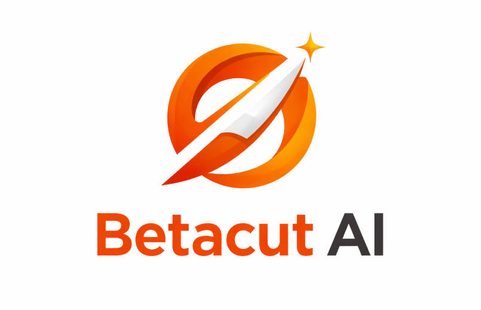

<div align="center">
  
  <h1>Betacut AI</h1>

  

  <p><strong>A lightning-fast, privacy-first, 100% frontend AI background removal tool.</strong></p>
</div>

<br />

Betacut AI is a web-based utility that removes image backgrounds locally within your browser using state-of-the-art Machine Learning models. Powered by `Transformers.js` and the `MODNet` Image Matting pipeline, no images are ever sent to a server.

## ✨ Features

- **On-Device AI:** Runs cutting-edge `Xenova/modnet` models directly in the browser using WebAssembly and WebGL/WebGPU.
- **Privacy First:** 100% Client-side. No sign-ups required. No image uploads to an external server. Your data never leaves your machine.
- **Lightning Fast:** Once the initial model (~50MB) is cached, processing happens near-instantly.
- **Custom Post-Processing Engine:** Features an advanced edge decontamination and alpha-matte feathering system (using `HTML5 Canvas`) to retain high detail around hair and soft edges.
- **Customizable Output:** Instantly swap to a Transparent, Solid White, Solid Black, or Custom Color background. 
- **Modern Liquid Glass UI:** A sleek, minimal, premium design aesthetic built entirely with Vanilla CSS.

## 🛠️ Technology Stack

- **Vanilla HTML5 & CSS3:** No frontend frameworks. Just clean semantic structure and custom stylesheets without the bulk of UI libraries.
- **Vite:** Next-generation frontend tooling for rapid development and optimized builds.
- **JavaScript (ES Modules):** Clean, modular, and dependency-light logic structure.
- **[Transformers.js](https://github.com/huggingface/transformers.js):** Hugging Face's library for running models flawlessly inside the browser.
- **[@imgly/background-removal](https://img.ly/showcases/cesdk/web/background-removal/web):** Utilized for Node.js offline scripts and system integrations (ONNX-based).

## 🚀 Getting Started

To run Betacut AI locally, follow these simple steps.

### Prerequisites
- [Node.js](https://nodejs.org/) (v18+)

### Installation

1. **Clone the repository (or navigate to the project directory):**
   ```bash
   cd bg_remover_system
   ```

2. **Install all dependencies:**
   ```bash
   npm install
   ```

3. **Start the Vite development server:**
   ```bash
   npm run dev
   ```

4. **Open in Browser:**
   Visit `http://localhost:5173/` in your browser to start removing backgrounds!

## 📦 Building for Production

When you are ready to deploy to production, run:
```bash
npm run build
```
This will bundle and optimize all CSS, JS, and assets into the `dist/` folder, ready to be served on any static file host (e.g., Vercel, Netlify, GitHub Pages).

## 🧪 Testing & Utility Scripts

The project includes standalone Node.js scripts for testing the AI model outside the browser. These are useful if you want to verify the model works on your system or generate demo assets.

| Script | Command | What it does |
|---|---|---|
| `generateMask.mjs` | `node generateMask.mjs` | Downloads a sample image, runs background removal via `@imgly/background-removal`, and saves the Before/After demo images (`demo-before.jpg` & `demo-after.png`) into the `public/` folder. |
| `test-infer.mjs` | `node test-infer.mjs` | Loads the `Xenova/modnet` model and runs a full end-to-end inference on a sample person image. Logs the output mask dimensions and label to confirm the pipeline works correctly. |
| `test-modnet.mjs` | `node test-modnet.mjs` | A quick smoke test — downloads and initializes the MODNet model to verify it loads successfully without errors. Does not process any image. |

> **Note:** These scripts are **not** required to run the web app. They are development/testing utilities for contributors and developers who want to verify the AI pipeline independently.

## 🤝 Contributing

Contributions, issues, and feature requests are welcome! 
Feel free to check the issues page.

---
**Disclaimer**: Running deep learning models in the browser is heavily dependent on the hardware capabilities of the user's device (specifically, their GPU when utilizing WebGPU/WebGL via WASM proxies). Peak performance requires a modern device.

<div align="center">
  <small>© 2026 Betacut AI · 100% Frontend</small>
</div>
